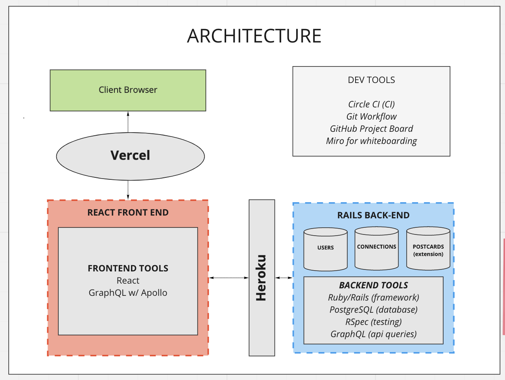
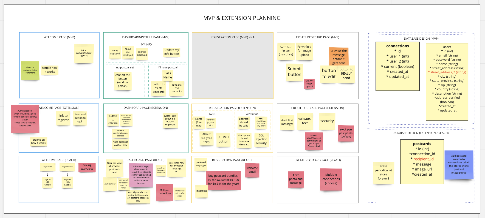
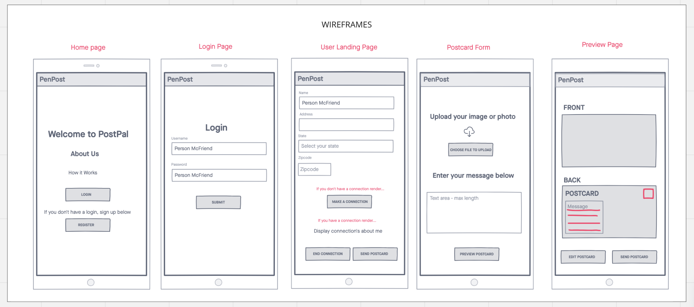

<!-- PROJECT SHIELDS -->
<!--
*** I'm using markdown "reference style" links for readability.
*** Reference links are enclosed in brackets [ ] instead of parentheses ( ).
*** See the bottom of this document for the declaration of the reference variables
*** for contributors-url, forks-url, etc. This is an optional, concise syntax you may use.
*** https://www.markdownguide.org/basic-syntax/#reference-style-links
-->
[![Contributors][contributors-shield]][contributors-url]
[![Forks][forks-shield]][forks-url]
[![Stargazers][stars-shield]][stars-url]
[![Issues][issues-shield]][issues-url]
[![MIT License][license-shield]][license-url]
[![LinkedIn][linkedin-shield]][linkedin-url]

<!-- PROJECT LOGO -->
<br />
<p align="center">
  <a href="https://github.com/penpost/penpost-api">
    
  </a>

  <h3 align="center">PenPost</h3>

  <p align="center">
    Real people, real postcards, real connections. PenPost allows you to send a PostCard to a friend with a click of a button. Snap an image, write a note, and we'll do all the work.
    <br />
    <a href="https://github.com/penpost/penpost-api"><strong>Explore the docs »</strong></a>
    <br />
    <br />
    <a href="https://github.com/penpost/penpost-api">View Demo</a>
    ·
    <a href="https://github.com/penpost/penpost-api/issues">Report Bug</a>
    ·
    <a href="https://github.com/penpost/penpost-api/issues">Request Feature</a>
  </p>
</p>


<!-- TABLE OF CONTENTS -->
<details open="open">
  <summary><h2 style="display: inline-block">Table of Contents</h2></summary>
  <ol>
    <li>
      <a href="#about-the-project">About The Project</a>
      <ul>
        <li><a href="#built-with">Built With</a></li>
      </ul>
    </li>
    <li>
      <a href="#getting-started">Getting Started</a>
      <ul>
        <li><a href="#prerequisites">Prerequisites</a></li>
        <li><a href="#installation">Installation</a></li>
      </ul>
    </li>
    <li><a href="#usage">Usage</a></li>
    <li><a href="#roadmap">Roadmap</a></li>
    <li><a href="#contributing">Contributing</a></li>
    <li><a href="#license">License</a></li>
    <li><a href="#contact">Contact</a></li>
    <li><a href="#acknowledgements">Acknowledgements</a></li>
  </ol>
</details>


<!-- ABOUT THE PROJECT -->
## About The Project

This is the backend component of the PenPost service-oriented architecture. The React+Apollo front-end communicates with this back-end via an API. This repository utilizes GraphQL to expose that API to meet the front-end requirements.

 

### Built With

* [Ruby on Rails](https://rubyonrails.org/)
* [PostgreSQL](https://www.postgresql.org/)
* [GraphQL](https://graphql.org/)
* [RSpec](https://github.com/rspec/rspec-rails)
* [Circle CI](https://circleci.com/)
* [Heroku](https://heroku.com/)
* [Github Project Board](https://github.com/aetzion1/tweeter/projects/1)

<!-- GETTING STARTED -->
## Getting Started

To get a local copy up and running follow these simple steps.

### Prerequisites

1. Ensure you have Ruby/Rails installed and set up
2. Ensure you have PostgreSQL installed 

### Installation

1. Fork the repository and clone the repo
  ```sh
  git clone https://github.com/<USERNAME>/penpost-api.git
  ```
2. Run bundle install
  ```sh
   bundle install
   ```
3. Set up the databases 
  ```sh
   rails db:{create,migrate}
   ```

<!-- USAGE EXAMPLES -->
## Usage

Users are able to log into their accounts and access their dashboard.

The dashboard will display a user's information (address, description) and allow them to edit this info.

The dashboard will also display the user's current PenPal's name and city - and an option to end the realtionship. If the user has no active PenPal there will be a button to create one!

The user can draft a postcard directly on the web app - and is able to preview the postcard prior to sending.

<!-- ROADMAP -->
## Roadmap

 The app was developed with the help of a 5-person team, over the course of 10 days. The team began with an initial product brainstorm and wireframes.





Development was managed via a kandban-style [Github project board](https://github.com/orgs/penpost/projects/1).

See the [open issues](https://github.com/penpost/penpost-api/issues) for a list of proposed features (and known issues).

<!-- CONTRIBUTING -->
## Contributing

Contributions are what make the open source community such an amazing place to be learn, inspire, and create. Any contributions you make are **greatly appreciated**.

1. Fork the Project
2. Create your Feature Branch (`git checkout -b feature/AmazingFeature`)
3. Commit your Changes (`git commit -m 'Add some AmazingFeature'`)
4. Push to the Branch (`git push origin feature/AmazingFeature`)
5. Open a Pull Request

<!-- LICENSE -->
## License

Distributed under the MIT License. See `LICENSE` for more information.

<!-- CONTACT -->
## Contact

Adam Etzion - [GitHub](https://github.com/aetzion1) [LinkedIn](https://www.linkedin.com/in/adametzion/)

Gabrielle - [GitHub]() [LinkedIn]()

Jeff - [GitHub]() [LinkedIn]()

Kelsie - [GitHub]() [LinkedIn]()

Yesi Meza - [GitHub](https://github.com/Yesi-MC) [LinkedIn](https://www.linkedin.com/in/yesimeza/)

Project Repository Link: [https://github.com/penpost/penpost-api](https://github.com/penpost/penpost-api)

<!-- ACKNOWLEDGEMENTS -->
## Acknowledgements

* [Img Shields](https://shields.io)
* [Pexels](https://www.pexels.com/) for above image
* [Miro](https://www.miro.com/) for whiteboard tools


<!-- MARKDOWN LINKS & IMAGES -->
<!-- https://www.markdownguide.org/basic-syntax/#reference-style-links -->
[contributors-shield]: https://img.shields.io/github/contributors/penpost/penpost-api.svg?style=for-the-badge
[contributors-url]: https://github.com/penpost/penpost-api/graphs/contributors
[forks-shield]: https://img.shields.io/github/forks/penpost/penpost-api.svg?style=for-the-badge
[forks-url]: https://github.com/penpost/penpost-api/network/members
[stars-shield]: https://img.shields.io/github/stars/penpost/penpost-api.svg?style=for-the-badge
[stars-url]: https://github.com/penpost/penpost-api/stargazers
[issues-shield]: https://img.shields.io/github/issues/penpost/penpost-api.svg?style=for-the-badge
[issues-url]: https://github.com/penpost/penpost-api/issues
[license-shield]: https://img.shields.io/github/license/penpost/penpost-api.svg?style=for-the-badge
[license-url]: https://github.com/penpost/penpost-api/blob/master/LICENSE.txt
[linkedin-shield]: https://img.shields.io/badge/-LinkedIn-black.svg?style=for-the-badge&logo=linkedin&colorB=555
[linkedin-url]: https://linkedin.com/in/adametzion
